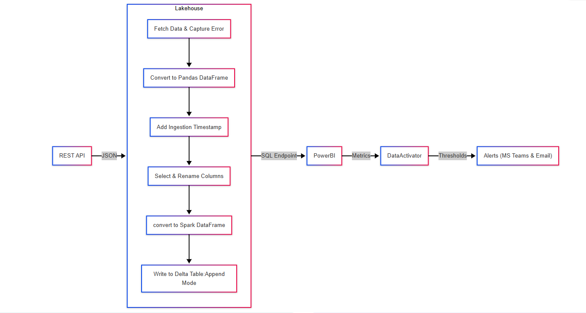
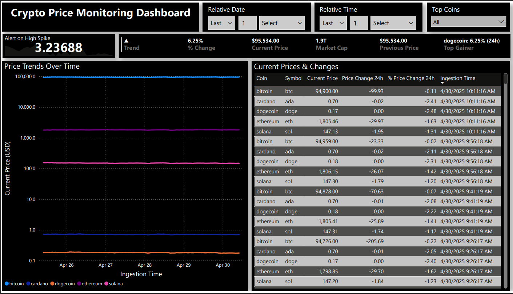
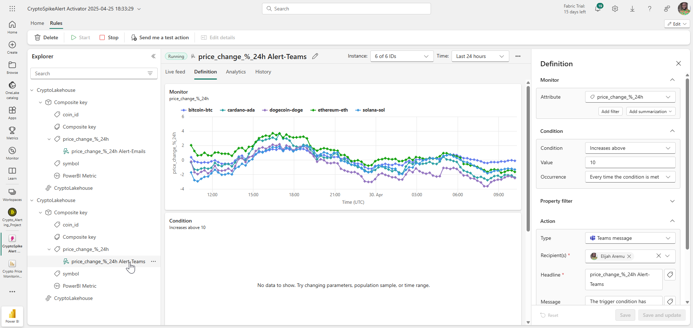
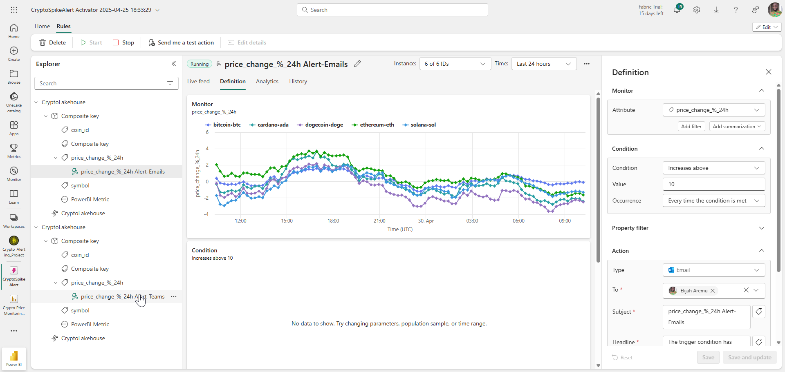
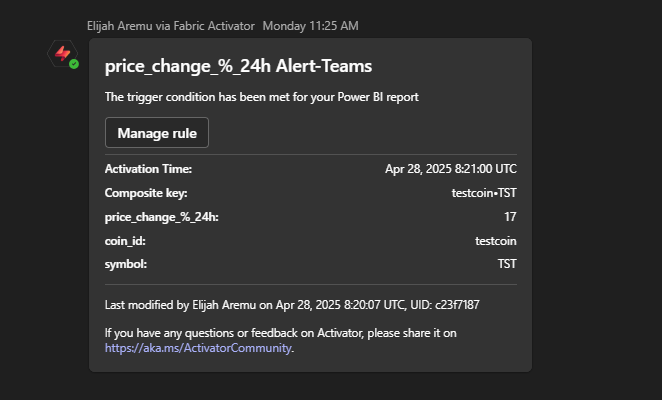
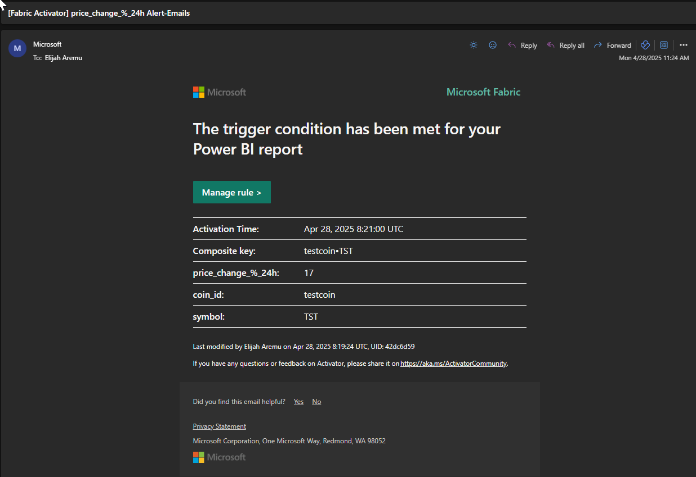

# 🚀 Crypto Price Spike Alerting System

A real-time cryptocurrency monitoring solution built using **Microsoft Fabric**, **Power BI**, and **Data Activator**. This project ingests live data from the CoinGecko API, analyzes trends and spikes in coin prices, and sends alerts when price surges occur.

---

## 🌎 Project Overview
Cryptocurrency prices are highly volatile. This project monitors top coins and triggers alerts when any experience a **significant 24-hour spike**, allowing users to react quickly to market movements.

---

## 🤷 What This Project Does

- Ingests real-time coin data using CoinGecko API
- Stores and updates a Delta table in Microsoft Fabric Lakehouse
- Transforms and cleanses data using PySpark
- Visualizes key metrics and price trends in Power BI
- Uses Microsoft Data Activator to trigger Teams/email alerts

---

## 📆 Tools & Technologies Used
- Microsoft Fabric (Lakehouse + Notebooks)
- Power BI (DirectLake + Card visuals + KPI layout)
- PySpark (data ingestion & transformation)
- [CoinGecko API](https://api.coingecko.com/api/v3/coins/markets?vs_currency=usd&ids=bitcoin,ethereum,solana,cardano,dogecoin&order=market_cap_desc&per_page=5&page=1&sparkline=false)
- Microsoft Data Activator (Reflex alerts)
- Microsoft Teams (for alerts)

---

## 🔄 Architecture Diagram


Created using Mermaid Live Editor. [View Larger Diagram](https://www.mermaidchart.com/raw/fffdd599-f569-4c78-afd3-7aa960ce8877?theme=light&version=v0.1&format=svg)


---

## 📊 Dashboard Features

### 1. KPI Row
- **Alert on High Spike**: Shows coin with the highest % spike
- **Formatted Change**: +% or -% in last 24 hours
- **Current Price**: Live price
- **Market Cap**: Billion/T format
- **Previous Price**: Prior data point
- **High Spike Coin Summary**: e.g., `testcoin: +18%`

### 2. Price Trends Over Time (Line Chart)
- Shows historical price trend per coin
- Logarithmic Y-axis for clarity across wide price ranges

### 3. Current Prices & Changes (Table)
- All top tracked coins
- Current price, 24h change, % change
- Timestamped rows for trend analysis

---

## 🚀 Data Ingestion Pipeline

> 📑 **Note**: No separate "Pipeline" was created — instead, a **scheduled PySpark Notebook** acts as the full ingestion + transformation pipeline.

- Scheduled every 10–15 mins
- Fetches from API
- Transforms into Delta Lake table `coin_price_data`
- Handles nulls, time columns, and optional test inserts

---

## 📊 Data Model

```text
coin_price_data (Delta Table)
- coin_id
- symbol
- name
- current_price
- market_cap
- price_change_24h
- price_change_percentage_24h
- ingestion_timestamp
```

---

## 🔊 Data Activator Setup

- Visual trigger: Power BI visual (e.g., Table or KPI)
- Trigger rule: `price_change_percentage_24h > 10`
- Action: Sends Teams or email alert with coin name, value, timestamp

Example Message:
```text
🚨 testcoin has spiked by 18.0% in the last 24h.
Current Price: $95,534
Time: 2025-04-29 10:41 AM
```

> ⚠️ Make sure Power BI visual is showing *all coin IDs* (avoid Top N filters).

---

## 🔧 How to Use This Project

### 1. Clone or Fork
```bash
git clone https://github.com/elijaydot/Crypto-API-Alerting-MSFabric.git
```

### 2. Setup Lakehouse in Fabric
- Create Lakehouse workspace
- Add notebook for ingestion
- Create table: `coin_price_data`

### 3. Paste and Run the PySpark Script
- Schedule to run every 15 mins

### 4. Connect Power BI to the Lakehouse
- Use DirectLake mode
- Add visuals: Table, Line Chart, KPI Card (New), Slicer

### 5. Setup Data Activator
- Right-click Power BI visual → "Use in Data Activator"
- Add alert rule
- Send alert via Email or Teams

---

## 🔀 Advanced (Optional Features)
- Simulate spikes by inserting testcoin rows
- Add Unicode arrow indicators (▲ / ▼) in card titles
- Apply conditional formatting (green/red) to show trend direction
- Format Market Cap dynamically (M/B/T)
- Use slicers to filter by coin

---

## 📷 Screenshot Highlights

- Power BI dashboard full view
- Data Activator rule setup MS Teams
- Data Activator rule setup Email
- Sample alert in MS Teams
  - 
- Sample alert in Email 

---

## 🧡 Why This Matters
This project simulates a real-world crypto alert system with **low-code tools** and **cloud-native orchestration**. It shows how Microsoft Fabric can be used to automate ingestion, transformation, visualization, and alerting in one unified platform.

---

## 🚀 Future Improvements
- Implement 30-min drop detection via PySpark
- Expand to top 20 coins
- Add moving averages, trendlines, and volatility bands

---

## 📝 License
MIT License

---

## 📆 Author
**Elijah Aremu**  
Fabric Enthusiast | Data Analyst | Python + Power Platform Developer | SME D365 F&O

> Want to collaborate or connect? [LinkedIn](https://www.linkedin.com/in/elijaharemu/)  

